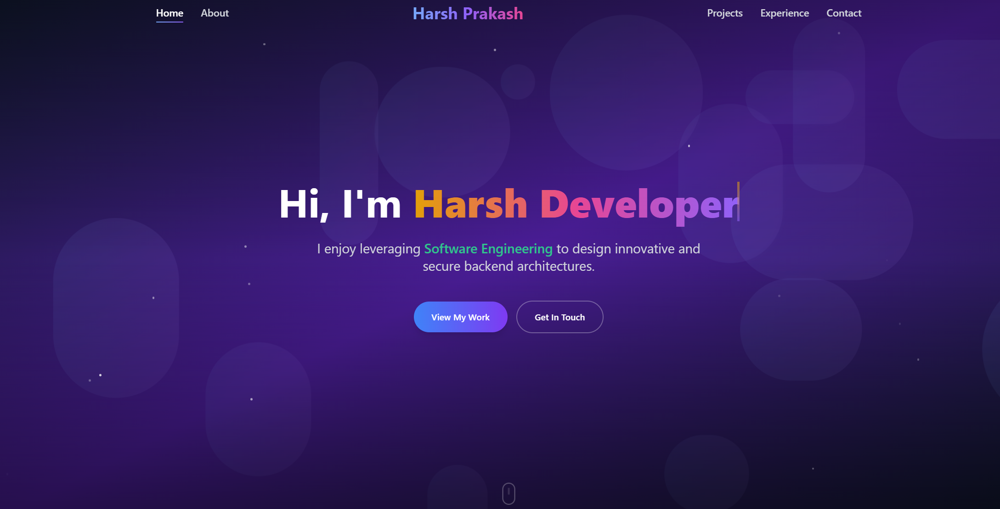

# Harsh Prakash - Portfolio

Welcome to my personal portfolio website! This repository contains the source code for my professional portfolio showcasing my skills, projects, and experiences as a Software Engineer and Data Analyst.

## 🌐 Live Demo

Check out the live version of my portfolio: [https://harshprakash23.github.io/Portfolio/](https://harshprakash23.github.io/Portfolio/)

## 📋 Table of Contents

- [About](#about)
- [Projects](#projects)
- [Technologies](#technologies)
- [Experience](#experience)
- [Skills](#skills)
- [Screenshots](#screenshots)
- [Setup](#setup)
- [Contact](#contact)

## 🙋‍♂️ About

I'm **Harsh Prakash**, a final-year B.Tech student at Vellore Institute of Technology, specializing in Internet of Things. I'm passionate about software engineering, data analytics, and innovative tech solutions.

### 🔧 Technical Expertise

- **Programming & Development**: Java, Python, C, C++, React.js, Node.js, Spring Boot
- **Web & Backend Development**: REST APIs, MySQL, scalable systems
- **Data Analytics & Visualization**: SQL, MySQL, Excel, Tableau, Power BI, scikit-learn
- **Cloud & Security**: AWS (S3, IAM), cybersecurity fundamentals
- **AI & Prompt Engineering**: IBM WatsonX, NLP projects

## 🚀 Projects

### 1. DineDash
An online food ordering platform with a responsive interface built using HTML, CSS, and JavaScript.

### 2. Portfolio
A personal portfolio website built with React.js, featuring interactive UI components and responsive design.

### 3. Attendance Management System
A comprehensive system built with the MERN-like stack (React.js, Node.js, Express.js, MySQL) with role-based access control.

### 4. Dynamic Forms
A dynamic form-building application using React.js, Spring Boot, and MySQL with Excel export functionality.

## 🛠 Technologies

- **Frontend**: React.js, Tailwind CSS, Framer Motion, Flowbite
- **Backend**: Node.js, Express.js, Spring Boot
- **Database**: MySQL
- **Tools**: Git, GitHub Pages, Postman
- **Cloud**: AWS (S3, IAM)

## 💼 Experience

### Hindustan Petroleum Corporation Limited (HPCL)
**Software Development Intern** (June 2025 – July 2025)
- Built a Full-stack HPCL Form Backend using Java Spring Boot and MySQL
- Implemented hierarchical role-based access control
- Enabled multi-instance form filling and Excel export

### Tata Steel
**Data Analytics Intern** (May 2025 – June 2025)
- Built a Stack Emission Prediction System for the Sinter Plant
- Developed machine learning models for emission prediction
- Created a backend engine for automated, proactive control

### IBM
**Generative AI Intern (WatsonX)** (May 2025 – June 2025)
- Completed IBM's Generative AI program covering LLM deployment
- Built a Sentiment Analysis Model on movie reviews
- Developed NexusAI, a conversational AI system

### Trainity
**Data Analyst Intern** (July 2024 – September 2024)
- Completed coursework in Data Analytics, Excel, MySQL, Statistics, Tableau, and Python
- Analyzed and visualized complex datasets to support business decision-making

## 🎯 Skills

- **Languages**: Java, Python, C, C++, JavaScript, SQL
- **Frameworks & Libraries**: React.js, Node.js, Spring Boot, Express.js
- **Databases**: MySQL
- **Tools & Platforms**: Git, GitHub, Postman, AWS, Tableau, Power BI
- **Concepts**: REST APIs, RBAC, Machine Learning, Data Analytics, Cybersecurity

## 📸 Screenshots

<!-- Project screenshots will be displayed here -->

<p align="center">
  
</p>


## 🛠 Setup

To run this portfolio locally:

1. Clone the repository:
   ```bash
   git clone https://github.com/harshprakash23/Portfolio.git
   ```

2. Navigate to the project directory:
   ```bash
   cd Portfolio
   ```

3. Install dependencies:
   ```bash
   npm install
   ```

4. Start the development server:
   ```bash
   npm start
   ```

5. Open [http://localhost:3000](http://localhost:3000) in your browser

## 📄 License

This project is licensed under the MIT License - see the [LICENSE](LICENSE) file for details.

## 📞 Contact

Feel free to reach out to me through any of the following platforms:

- **LinkedIn**: [Harsh Prakash](https://www.linkedin.com/in/harsh-prakash-510b38246/)
- **Email**: [Send me an email](mailto:harshprakash5189@gmail.com)
- **GitHub**: [harshprakash23](https://github.com/harshprakash23)

---

⭐️ From [Harsh Prakash](https://github.com/harshprakash23)
